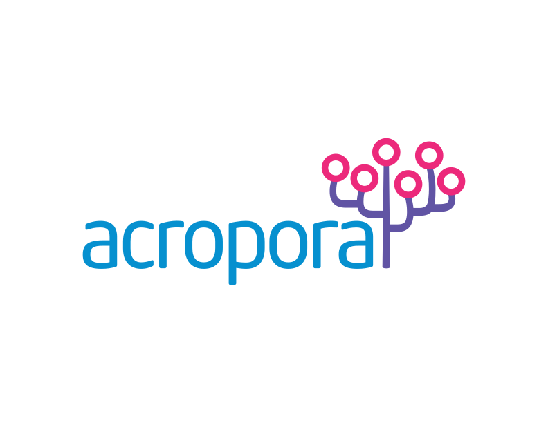

<p align="left">
  
</p>

# Acropora

[](https://pkg.go.dev/github.com/simonmittag/acropora)
[](https://goreportcard.com/report/github.com/simonmittag/acropora)

**Acropora** is an alpha-stage Go library for storing directional subject–predicate–object triples on PostgreSQL. It provides a small, explicit persistence layer for semantically constrained graph-like data without the overhead of a dedicated graph database.

> [!CAUTION]
> **Status: Alpha Version.** Acropora is currently unreleased and under active development. APIs are subject to change.

## Core Concepts

Acropora is designed for teams that need more structure than a simple JSONB column but want to stay within the reliable PostgreSQL ecosystem.

- **Ontology First**: Define your domain model (entities, predicates, and allowed triple patterns) before persisting data.
- **Versioning**: Ontologies are explicitly versioned and hashed, ensuring data integrity across schema evolutions.
- **Canonicalization**: Entities are automatically canonicalized (normalized) to handle variations in naming (e.g., "John Doe" vs "john  doe").
- **Referential Integrity**: Unlike raw JSONB, Acropora enforces that triples must follow the patterns defined in your ontology.
- **Entity Aliasing**: Support for linking multiple entity aliases to a single canonical entity.

## Up and Running

### Prerequisites

- Go 1.21+
- PostgreSQL 13+

### Installation

```bash
go get github.com/simonmittag/acropora
```

### Initializing the Database

Acropora manages its own internal schema migrations using [Goose](https://github.com/pressly/goose).

```go
import (
    "context"
    "database/sql"
    "github.com/simonmittag/acropora"
    _ "github.com/lib/pq"
)

func main() {
    ctx := context.Background()
    sqlDB, _ := sql.Open("postgres", "postgres://localhost/mydb?sslmode=disable")
    
    db, err := acropora.New(ctx, sqlDB)
    if err != nil {
        panic(err)
    }
}
```

## Examples

### 1. Seeding an Ontology

Define the rules for your graph. In this example, we define that a `Person` can `work_at` a `Company`.

```go
def := acropora.Definition{
    Entities: []acropora.EntityDefinition{
        {Type: "Person"},
        {Type: "Company"},
    },
    Predicates: []acropora.PredicateDefinition{
        {Type: "works_at"},
    },
    Triples: []acropora.TripleDefinition{
        {
            Subject:   &acropora.EntityDefinition{Type: "Person"},
            Predicate: &acropora.PredicateDefinition{Type: "works_at"},
            Object:    &acropora.EntityDefinition{Type: "Company"},
        },
    },
}

version, _ := db.SeedOntology(ctx, sqlDB, def, acropora.SeedOptions{Slug: "v1"})
```

### 2. Working with a Session

Once the ontology is seeded, use a `Session` to interact with your data.

```go
session := db.NewSession(version)

// Insert Entities
person, _ := session.InsertEntity(ctx, acropora.Entity{
    EntityDefinition: acropora.EntityDefinition{Type: "Person"},
    RawName: "John Doe",
})

company, _ := session.InsertEntity(ctx, acropora.Entity{
    EntityDefinition: acropora.EntityDefinition{Type: "Company"},
    RawName: "Acme Corp",
})

// Create a Triple (Subject - Predicate - Object)
// Predicates defined in the ontology are available during runtime
triple, err := session.InsertTriple(ctx, acropora.Triple{
    SubjectEntityID: person.ID,
    PredicateID:     "works_at",
    ObjectEntityID:  company.ID,
})
```

